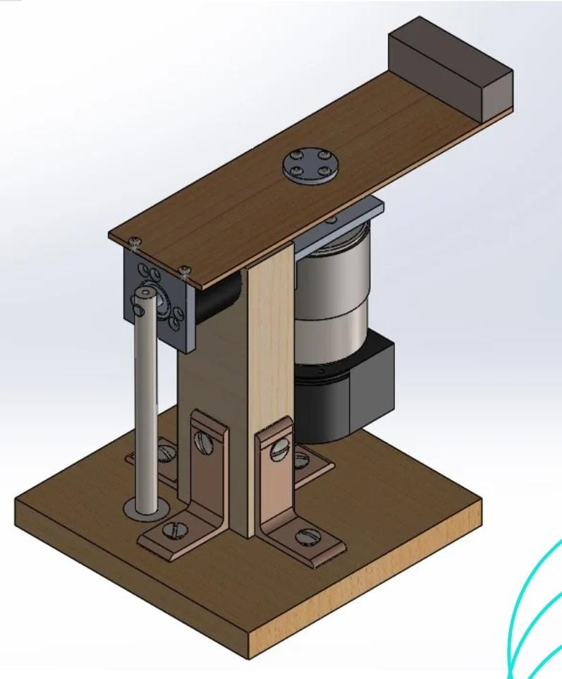
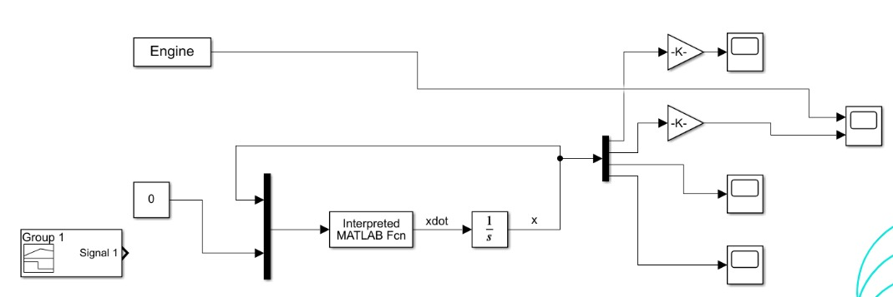
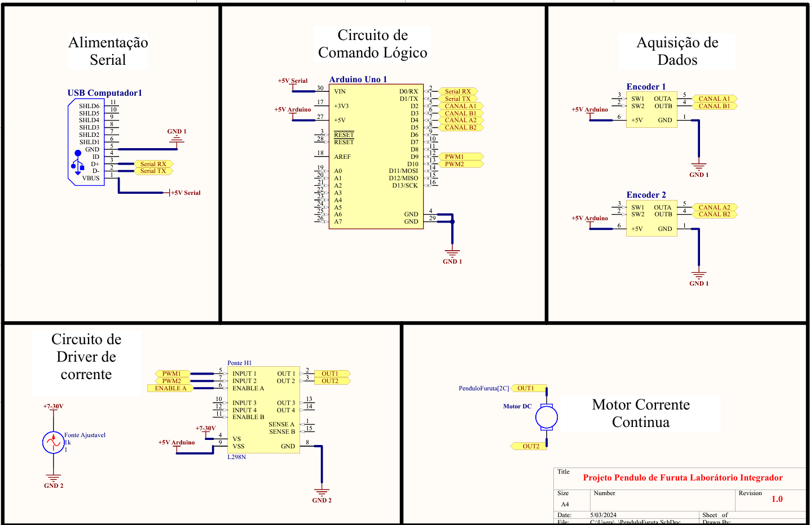
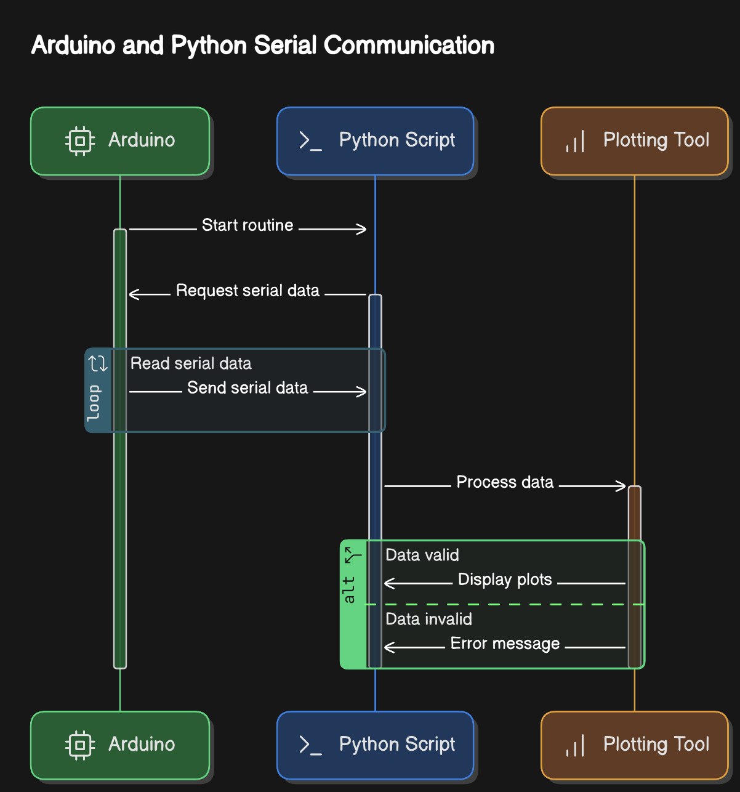

# Pêndulo de Furuta

Projeto da disciplina de Laboratório Integrador da turma 2024/1, no qual, foi realizado a construção e desenvolvimento integral de um Pêndulo de Furuta.

Mecânica

Utilizamos o SolidWorks para modelar em 3D todo o projeto, o que nos permitiu desenhar todos os componentes necessários e ter uma visão abrangente das etapas envolvidas. Isso inclui desde a fabricação dos componentes que podemos produzir internamente até aqueles que precisaremos terceirizar. Além disso, conseguimos estimar com precisão o peso e as dimensões do projeto, aspectos cruciais para seu funcionamento adequado.

Os principais elementos do projeto incluem uma haste de MDF de 6mm, um pêndulo de aço, mancais de alumínio aeronáutico, e uma estrutura de madeira fixada por dobradiças. Adicionalmente, dispomos de 2 encoders e um motor.

Controle

Elétrica
Para a execução do projeto elétrico, inicialmente, o grupo realizou um estudo geral a respeito dos conceitos de motores para relembrar e escolher qual tipo de motor seria mais vantajoso para a aplicação do projeto.
Após a escolha de possíveis tipos de motores, foi necessário verificar a aplicação no projeto, calculando os valores de inércia esperados e dimensionando o projeto elétrico tanto do motor quanto do driver de potência para ser utilizado, de modo a manter o projeto eficaz e evitar o encarecimento do mesmo. Além disso, coube à divisão elétrica se responsabilizar pelos encoders utilizados no projeto, tanto para conhecimento da posição do motor da plataforma, quanto para a posição do pêndulo.
Com os componentes elétricos definidos, foi realizado, primeiramente os testes inciais em protoboards para verificar se os componentes funcionavam do modo esperado, e obtendo os resultados pendentes, seguiu-se para a realização do tratamento dos dados obtidos pelos sensores para aquisição dos dados e recepção dos valores de PWM pelo motor.
O projeto elétrico finalizou com a montagem e integração dos componentes elétricos com as bases mecânicas para que fosse completo o modelo físico do pêndulo e assim, ficasse pronto para os testes completos na plataforma do pêndulo de Furuta.

Programação

O código de um pêndulo de Furuta tem como objetivo controlar o movimento de um sistema físico conhecido como pêndulo invertido de Furuta. Esse sistema consiste em um pêndulo que pode girar livremente em torno de um eixo vertical, enquanto outro eixo horizontal é utilizado para controlar a posição do pêndulo.

O objetivo principal do código é implementar um algoritmo de controle que permita estabilizar o pêndulo em uma posição desejada. Isso envolve medir a posição atual do pêndulo, calcular a ação de controle necessária e aplicar essa ação para manter o pêndulo equilibrado.

O código pode incluir diferentes componentes, como leitura de sensores para obter a posição do pêndulo, cálculos para determinar a ação de controle adequada, e envio de sinais para atuar nos motores ou dispositivos responsáveis por mover o eixo horizontal.

Além disso, o código também pode envolver a implementação de algoritmos de controle avançados, como controle PID (Proporcional-Integral-Derivativo), para melhorar a estabilidade e precisão do sistema.

Em resumo, o objetivo do código de um pêndulo de Furuta é controlar o movimento desse sistema físico complexo, permitindo que ele se mantenha em uma posição desejada de forma estável e precisa.

## Autores

- [@Caio Augusto](https://www.linkedin.com/in/caio-augusto-engca?lipi=urn%3Ali%3Apage%3Ad_flagship3_profile_view_base_contact_details%3BQjqr0tgPTuu%2BqRL5hENzSA%3D%3D)

- [@Diogo Nunes Carvalho](https://www.linkedin.com/in/diogo-nunes-carvalho-2b1832205?lipi=urn%3Ali%3Apage%3Ad_flagship3_profile_view_base_contact_details%3Baf4d4FilTeGUlDjnP42RJg%3D%3D)

- [@Rodrigo Marques Duarte](https://www.linkedin.com/in/rodrigo-marques-duarte-b49691284/overlay/contact-info/?lipi=urn%3Ali%3Apage%3Ad_flagship3_profile_view_base%3BAxTatQ1DQO2aoA9Gp4Fgog%3D%3D)

- [@Pedro Henrique de Souza Costa](https://www.linkedin.com/in/pedro-henrique-de-souza-costa-6ab729214?lipi=urn%3Ali%3Apage%3Ad_flagship3_profile_view_base_contact_details%3BbTN5JlOfQlG4pj21cnUcOg%3D%3D)

- [@Marcos Carvalho Ferreira](https://www.linkedin.com/in/marcos-carvalho-ferreira?lipi=urn%3Ali%3Apage%3Ad_flagship3_profile_view_base_contact_details%3BjZ2X8fCcTcSNEBTX63yc5w%3D%3D)

- [@Rian Pinas](www.linkedin.com/in/rian-pinas)

- [@Guilherme Henrique Salvador](https://www.linkedin.com/in/ghsalvador)

- [@Matheus Duarte](https://www.linkedin.com/in/matheus-duarte-de-assis-0450b721b/)

- [@Gian](https://www.linkedin.com/in/gian-ferreira-863b5a1a7/?utm_source=share&utm_campaign=share_via&utm_content=profile&utm_medium=android_app)

- [@Lucas](https://www.linkedin.com/in/lucas-leite-75267816b/)

- [@Nathan](https://www.linkedin.com/in/nathanhra/)

- [@Matheus Bernades](https://www.linkedin.com/in/mateus-bernardes-alves-de-oliveira-a4b9a72a6/)

## Mecânica

## Controle

## Eletrica

Segue lista de materiais ultilizados:

1x Arduino Mega 2560

1x Ponte-h dupla L298N

1x DC-Motor_51x73__1.13.044.0XX da Bulher Motor

2x Encoders rotativos de quadratura de 800 pulsos.

Abaixo segue modelo esquematico do circuito eletrico:

## Programação

Para uso do projeto e visualização das variáveis em tempo real é necessario conectar o arduino via USB no computador com código em c++ 'main.ino' já flashado. Após conexão do arduino na porta USB rodar o executável em Python Logging.py para uso do surpervisório e acquisição de dados via serial.

Com o executável em python já rodando será preciso escolher qual o algoritmo de controle executar SwingUp ou Equilibrar, onde o Swing Up fará o pendulo em posiçãpo pra baixo estabilizar pra cima e o Equilibrar fará o pendulo se autocorrigir e manter a estabilização caso tenha alguma pertubação.

Para isso será necessario mandar um comando via serial do arduino na inteface serial da arduino IDE ou do proprio plotter da plataforma, ou mesmo ultilizando o supervisório feito para o projeto clicando nos botôes referentes.

Abaixo segue demonstrativo do supervisório e modelo de diagrama do projeto. 

